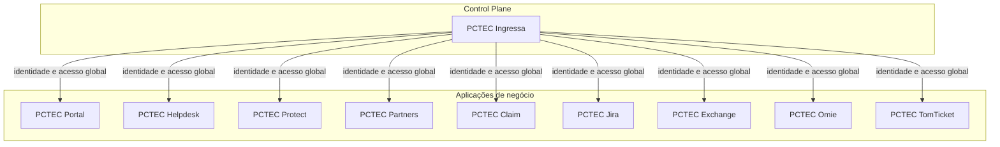
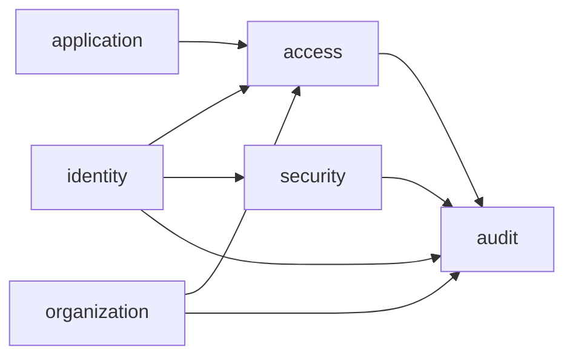
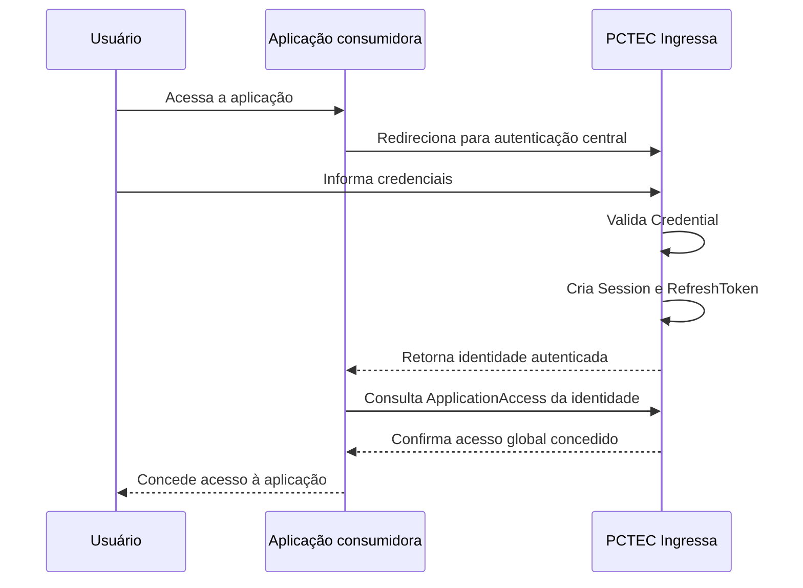
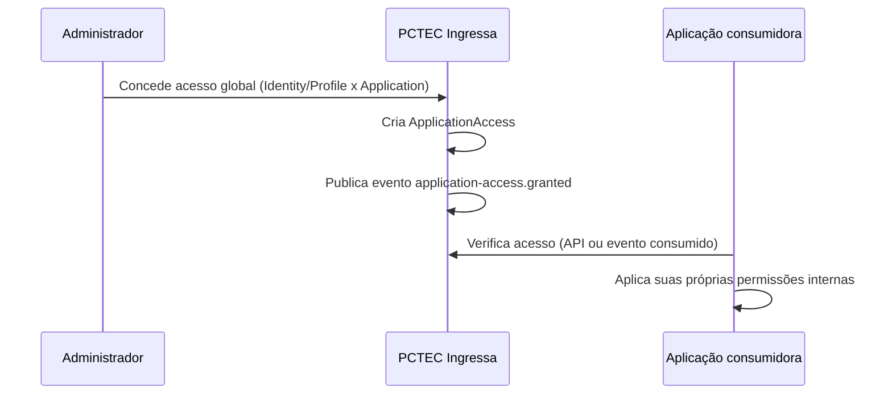
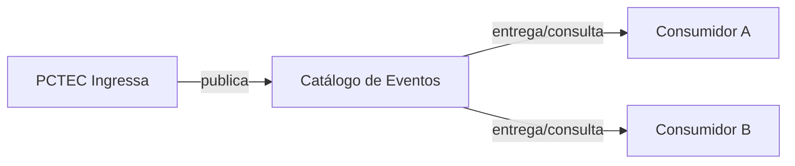

# Software Architecture Blueprint — PCTEC Ingressa

Versão associada: v0.2.0 — Domain Foundation
Status: Proposto para revisão do Product Owner e do Platform Architect

Este documento complementa o `SAD.md` existente (visão de componentes de
alto nível) com uma visão de bounded contexts, fluxos conceituais e limites
explícitos do produto. Não substitui o SAD; detalha a camada de domínio.

## 1. Contexto do Ingressa

O Ingressa é o control plane de identidade e acesso do ecossistema PCTEC.
Ele não é um produto de negócio: é a infraestrutura corporativa da qual
produtos de negócio (Portal, Helpdesk, Protect, Partners, Claim, Jira,
Exchange, Omie, TomTicket) dependem para saber quem é o usuário, a quais
organizações ele pertence e se ele pode entrar naquele produto.

## 2. Bounded contexts

O domínio do Ingressa é dividido em seis bounded contexts. Cada um possui
responsabilidade clara e não invade a responsabilidade dos demais.

### 2.1 identity

Responsável por `Identity` e pelo ciclo de vida conceitual da entidade
digital reconhecida pela plataforma (criação, ativação, bloqueio,
inativação, exclusão lógica, anonimização). Não decide acesso a aplicações
nem a organizações — apenas quem a entidade é. Apenas o subtipo `HUMAN` é
implementado no primeiro escopo funcional (ADR-018). Especificação
detalhada: `docs/03-dominio/IDENTITY-DOMAIN-DESIGN.md` (v0.3.0).

**Nota de correção (v0.3.0 — ADR-025):** a classificação relacional
`EMPLOYEE`/`CUSTOMER`/`PARTNER`/`SUPPLIER` (antes `IdentityProfile`) não
pertence a este bounded context — pertence a `organization`/`access`, por
depender da relação entre `Identity` e `Organization` (ver seção 2.2).

### 2.2 organization

Responsável pelo Cadastro Mestre de Organizations (grupos empresariais e
empresas), suas relações hierárquicas (OrganizationRelationship) e pelos
vínculos de identidades com organizações (Membership). Não decide
autenticação nem acesso a aplicações.

### 2.3 application

Responsável pelo catálogo de Applications do ecossistema PCTEC — quais
produtos existem, seus metadados de integração (nome técnico, URL base,
status). Não decide quem tem acesso; apenas o que existe para se ter acesso.

### 2.4 access

Responsável por ApplicationAccess — a concessão ou revogação de acesso
global de uma identidade/perfil a uma aplicação. É o único bounded context
que combina identidade, organização (quando aplicável ao critério de
concessão) e aplicação para decidir "esta identidade pode entrar neste
produto".

### 2.5 security

Responsável por Credential, MagicLink, Session e RefreshToken. Trata da
mecânica de autenticação e da gestão do ciclo de vida de sessões. Não
decide quem é a pessoa (isso é `identity`) nem o que ela pode acessar (isso
é `access`).

### 2.6 audit

Responsável por AuditEvent — o registro imutável de eventos relevantes
ocorridos nos demais bounded contexts. É consumidor de eventos dos outros
contextos, nunca produtor de decisões de negócio.

## 3. Relacionamento com consumidores

Produtos consumidores se relacionam com o Ingressa exclusivamente por:

- **API REST versionada** (`/api/v1/...`), síncrona, para leitura e escrita
  de identidade, organização, membership, aplicação, acesso, sessão e
  magic link.
- **Eventos de domínio** (futuro), assíncronos, para propagação de
  mudanças de estado sem necessidade de polling.
- **Sincronização periódica de reconciliação** (futuro), para corrigir
  divergências entre o estado local espelhado do consumidor e o estado
  autoritativo do Ingressa.

Nenhum consumidor acessa a base `pctec_ingressa` diretamente, por
biblioteca de banco, view compartilhada, replicação de baixo nível ou
qualquer outro mecanismo que não seja API ou evento.

## 4. Control plane versus aplicações de negócio

| | Control Plane (Ingressa) | Aplicações de negócio (consumidores) |
|---|---|---|
| Responsabilidade | Quem é o usuário, a quais organizações pertence, se pode acessar a aplicação | O que o usuário pode fazer dentro da aplicação |
| Dados de domínio | Identity, Organization, Membership, Application, ApplicationAccess, Credential, Session | Chamados, contratos, patrimônio, faturamento, logística, SLA, etc. |
| Banco | `pctec_ingressa`, exclusivo | Banco próprio de cada produto |
| Autenticação | Emite e valida sessão | Confia na sessão validada pelo Ingressa |
| Autorização | Global (entra ou não entra) | Local (o que pode fazer) |

## 5. Fluxo conceitual de autenticação

## 6. Fluxo conceitual de acesso a aplicações

## 7. Fluxo conceitual de eventos

Nesta fase, o mecanismo de transporte de eventos (barramento, fila ou
polling de API) não está definido. O catálogo de eventos
(`docs/02-arquitetura/CATALOGO-DE-EVENTOS.md`) define os eventos
conceituais independentemente do transporte escolhido futuramente.

## 8. Limites explícitos do produto

O Ingressa **não** é responsável por:

- Regras de negócio de nenhum produto consumidor (fechamento de chamado,
  edição de patrimônio, cancelamento de contrato, aprovação de recebimento,
  edição de SLA, e equivalentes).
- Permissões finas por funcionalidade dentro de um produto consumidor.
- Armazenar dados de negócio de terceiros (contratos, tickets, faturas).
- Ser um barramento de mensageria genérico para os demais produtos.
- Prover LDAP no núcleo do MVP (ver ADR-008).
- Modelar filiais, departamentos, locais logísticos ou unidades
  operacionais (fora do MVP; ver Modelo de Domínio, seção Organization).

## 9. Questões pendentes de decisão

- Mecanismo de transporte de eventos (barramento dedicado, fila, ou
  polling via API) — nenhuma tecnologia está aprovada nesta fase.
- Protocolo de SSO (OIDC é citado como direção em `PRINCIPIOS-DE-SEGURANCA.md`,
  mas não está formalizado em ADR nesta entrega).
