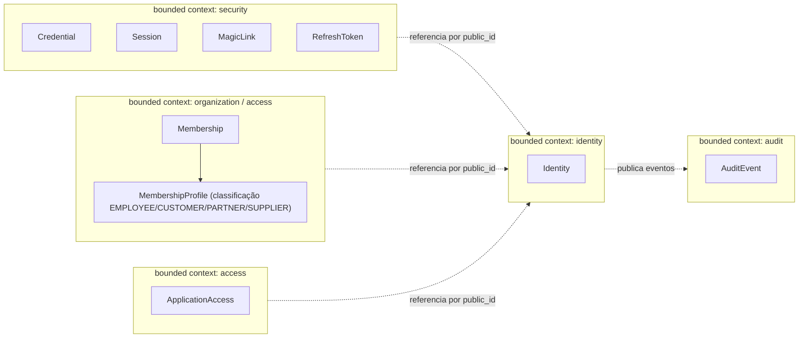
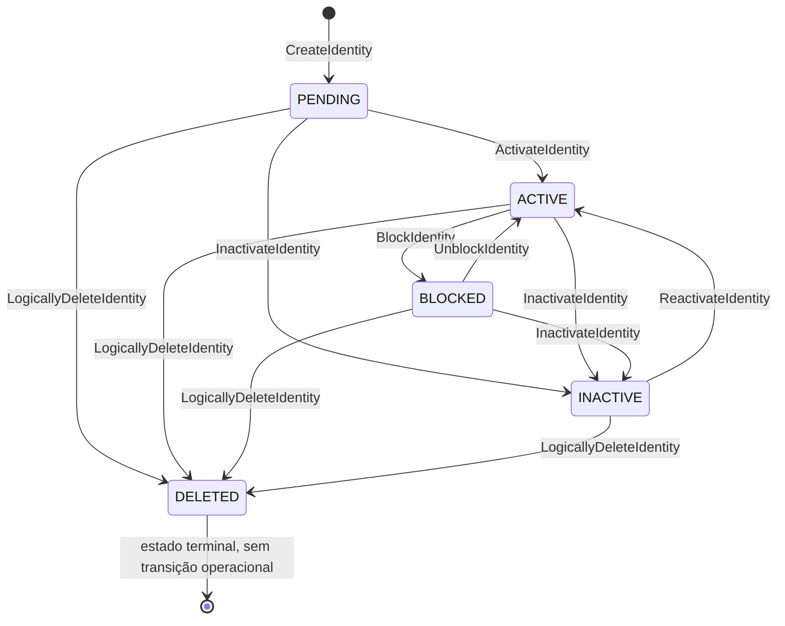
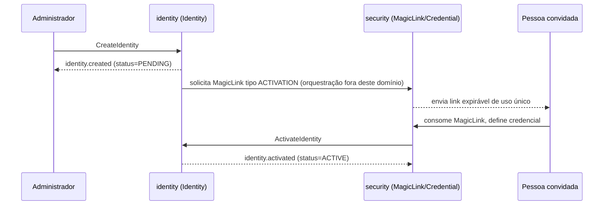

# Identity Domain Design — PCTEC Ingressa

Versão associada: v0.3.0 — Identity Core (documental)
Status: Proposto para revisão do Product Owner e do Platform Architect

Este documento é a especificação de domínio do bounded context `identity`,
detalhando o Aggregate Root `Identity` para além do resumo já presente em
`MODELO-DE-DOMINIO.md`. Ele não substitui aquele documento — o complementa
com o nível de detalhe necessário para implementação futura sem
ambiguidade. Todo termo usado aqui segue `IDENTITY-UBIQUITOUS-LANGUAGE.md`.

Este documento é exclusivamente documental: nenhum código, migration, API
funcional ou banco é criado a partir dele nesta fase.

**Nota de correção (ADR-025):** uma revisão desta entrega removeu
`IdentityProfile` do agregado `Identity` — classificações relacionais
(`EMPLOYEE`, `CUSTOMER`, `PARTNER`, `SUPPLIER`) pertencem ao `Membership`,
não à `Identity`, pois dependem da relação com uma `Organization`
específica. Todas as menções a `IdentityProfile`, aos comandos
`AddIdentityProfile`/`RemoveIdentityProfile`, aos eventos
`identity.profile-added`/`identity.profile-removed` e aos erros
`IDENTITY_PROFILE_ALREADY_EXISTS`/`IDENTITY_PROFILE_NOT_FOUND` foram
removidas deste documento.

---

## 1. Objetivo do domínio

O bounded context `identity` existe para responder, de forma confiável e
independente de qualquer aplicação consumidora, à pergunta "quem é esta
entidade reconhecida pela Plataforma PCTEC". Ele é o diretório mestre de
identidades — a fundação sobre a qual autenticação (`security`),
organização (`organization`) e acesso (`access`) se apoiam, sem depender
deles.

O domínio não resolve autenticação, sessão, organização ou autorização.
Resolve exclusivamente: existência, classificação, dados de diretório e
ciclo de vida de uma `Identity`.

## 2. Fronteiras do bounded context Identity

**Dentro do contexto `identity`:**

- Aggregate Root `Identity` (sem entidades filhas nesta entrega — ver Nota
  de correção abaixo).
- Value Objects de diretório (`PublicId`, `Email`, `NormalizedEmail`,
  `CPF`, `IdentityName`, `IdentityStatus`, `IdentityType`,
  `DeletionReason`).
- Comandos e eventos de ciclo de vida de diretório.

**Nota de correção (ADR-025):** a classificação relacional anteriormente
chamada `IdentityProfile` (`EMPLOYEE`, `CUSTOMER`, `PARTNER`, `SUPPLIER`)
**não** pertence ao bounded context `identity`. Ela depende da relação
entre `Identity` e `Organization`, e pertence ao contexto do `Membership`
(bounded context `organization`/`access`), sob o nome provisório
`MembershipProfile` — modelagem definitiva fora do escopo desta entrega.
`Identity` não possui, nesta especificação, nenhuma entidade filha.

**Fora do contexto `identity` (pertencem a outros bounded contexts já
definidos em ADR-014):**

- `Credential`, `Session`, `RefreshToken`, `MagicLink` → `security`.
- `Organization`, `OrganizationRelationship`, `Membership`,
  `MembershipProfile` (classificação relacional `EMPLOYEE`, `CUSTOMER`,
  `PARTNER`, `SUPPLIER`, associada ao vínculo, não à identidade — ADR-025)
  → `organization`/`access`.
- `Application`, `ApplicationAccess` → `application`/`access`.
- `AuditEvent` → `audit` (consumidor dos eventos deste contexto).

A fronteira é reforçada pelo ADR-017: `Identity` é raiz do diretório, não
da segurança.

## 3. Linguagem ubíqua

Ver `docs/03-dominio/IDENTITY-UBIQUITOUS-LANGUAGE.md` para o glossário
completo e obrigatório. Este documento usa os termos definidos lá sem
redefini-los.

## 4. Aggregate Root: Identity

**Atributos conceituais mínimos:**

| Atributo | Descrição |
|---|---|
| `id` | Chave interna `BIGINT UNSIGNED`. Nunca exposta (ADR-021). |
| `public_id` | UUID textual, imutável, identificador externo (ADR-021). |
| `type` | `IdentityType` — `HUMAN` no MVP (ADR-018). |
| `full_name` | Nome, representado pelo Value Object `IdentityName`. |
| `email` | E-mail de exibição, representado pelo Value Object `Email`. |
| `email_normalized` | Forma canônica do e-mail, Value Object `NormalizedEmail`. |
| `cpf` | CPF de exibição, opcional, Value Object `CPF`. |
| `cpf_normalized` | Forma canônica do CPF, opcional. |
| `status` | `IdentityStatus` — `PENDING`, `ACTIVE`, `BLOCKED`, `INACTIVE`, `DELETED`. |
| `login_enabled` | Booleano, independente de `status`. |
| `created_at` | Momento de criação. |
| `created_by_identity_public_id` | Actor que criou (pode ser `System Actor`). |
| `updated_at` | Momento da última alteração relevante. |
| `updated_by_identity_public_id` | Actor da última alteração relevante. |
| `deleted_at` | Preenchido apenas quando `status = DELETED`. |
| `deleted_by_identity_public_id` | Actor da exclusão lógica. |
| `deletion_reason` | Value Object `DeletionReason`, preenchido apenas na exclusão. |
| `version` | Controle de concorrência otimista (ADR-024). |

**Avaliação de outros atributos:** telefone, endereço, foto, cargo e
preferências foram avaliados e **não** pertencem ao núcleo `Identity`
nesta entrega — não há decisão formal que os inclua, e a governança desta
entrega proíbe adicioná-los sem decisão explícita (ver seção 15, "O que
não pertence ao domínio").

## 5. Entidades associadas

`Identity` não possui, nesta especificação, nenhuma entidade filha dentro
do próprio agregado. A classificação relacional anteriormente proposta
como `IdentityProfile` foi removida do domínio `identity` por ADR-025:
`EMPLOYEE`, `CUSTOMER`, `PARTNER` e `SUPPLIER` não são características
intrínsecas de uma `Identity`, pois dependem da relação com uma
`Organization` específica (a mesma `Identity` pode ter classificações
diferentes em organizações diferentes). Essa classificação pertence ao
contexto do `Membership` (bounded context `organization`/`access`), sob o
nome provisório `MembershipProfile`, cuja modelagem definitiva está fora do
escopo desta entrega.

## 6. Value Objects

### PublicId

- **Responsabilidade:** identificar `Identity` externamente de forma
  única, imutável e sem significado de negócio.
- **Validações:** deve ser um UUID textual sintaticamente válido.
- **Normalização:** nenhuma — é gerado uma única vez na criação e nunca
  reformatado.
- **Imutabilidade:** total; não pode ser alterado após a criação.
- **Serialização:** string, formato UUID padrão (`CHAR(36)` com hifens).
- **Dados proibidos:** não deve incorporar nenhum dado pessoal, sequencial
  previsível, ou informação de negócio (ex.: não deve ser derivado do
  e-mail ou CPF).

### Email

- **Responsabilidade:** representar o e-mail de exibição informado pela
  identidade ou por quem a cadastrou.
- **Validações:** formato sintático de e-mail válido; obrigatório (não
  pode ser vazio ou nulo).
- **Normalização:** não normaliza por si — delega à `NormalizedEmail` a
  forma canônica de comparação.
- **Imutabilidade:** o Value Object em si é imutável (qualquer alteração
  gera uma nova instância); a mudança do e-mail de uma `Identity` é uma
  operação de domínio explícita (`RequestEmailChange`/`ConfirmEmailChange`),
  nunca uma escrita direta.
- **Serialização:** string.
- **Dados proibidos:** não deve ser truncado ou mascarado neste Value
  Object — mascaramento, se necessário, é responsabilidade da camada que
  publica eventos ou logs (ver seção 8).

### NormalizedEmail

- **Responsabilidade:** fornecer a forma canônica do e-mail para
  comparação de unicidade case-insensitive.
- **Validações:** derivada sempre de um `Email` válido.
- **Normalização:** conversão para minúsculas; nenhuma outra transformação
  nesta fase (ex.: não remove sufixos do tipo `+tag@dominio`, pois essa
  regra não foi aprovada — **Pendente de decisão**).
- **Imutabilidade:** sim; recalculada sempre que `Email` muda.
- **Serialização:** string, usada apenas internamente para índice de
  unicidade — não é o valor de exibição.
- **Dados proibidos:** não deve ser exposta como o "e-mail" em nenhuma
  interface voltada ao usuário final; é um valor técnico de comparação.

### CPF

- **Responsabilidade:** representar o CPF de exibição, quando informado.
- **Validações:** opcional; quando presente, deve ter formato compatível
  com CPF (11 dígitos, com ou sem pontuação na entrada). Validação de
  dígito verificador é **Pendente de decisão** de implementação.
- **Normalização:** delega à forma normalizada (`cpf_normalized`) a
  comparação de unicidade.
- **Imutabilidade:** o Value Object é imutável; qualquer alteração é uma
  nova instância associada a uma operação de domínio explícita (comando de
  alteração de CPF não está no escopo desta entrega — **Pendente de
  decisão** se e como o CPF pode ser alterado após informado).
- **Serialização:** string.
- **Dados proibidos:** nunca exposto integralmente em eventos, logs
  voltados a consumidores ou payloads de API — apenas em consultas diretas
  e autorizadas (ver seção 14, Privacidade).

### IdentityName

- **Responsabilidade:** representar o nome completo da identidade.
- **Validações:** obrigatório, não vazio; tamanho máximo alinhado ao
  `full_name VARCHAR(255)` já proposto no modelo relacional.
- **Normalização:** nenhuma normalização de conteúdo além de espaços
  redundantes (trim); não normaliza capitalização, pois nome próprio não
  deve ser alterado arbitrariamente pelo sistema.
- **Imutabilidade:** o Value Object é imutável; alteração ocorre via
  comando `UpdateIdentityName`.
- **Serialização:** string.
- **Dados proibidos:** nenhum dado além do nome em si.

### IdentityStatus

- **Responsabilidade:** representar o estado de ciclo de vida.
- **Validações:** deve ser um dos cinco valores previstos (`PENDING`,
  `ACTIVE`, `BLOCKED`, `INACTIVE`, `DELETED`).
- **Normalização:** não aplicável (enum fechado).
- **Imutabilidade:** o valor pontual é imutável; a entidade transita entre
  valores conforme a máquina de estados (seção 10).
- **Serialização:** string/enum.
- **Dados proibidos:** não aplicável.

### IdentityType

- **Responsabilidade:** representar a natureza da identidade.
- **Validações:** deve ser um dos cinco valores previstos (`HUMAN`,
  `SERVICE`, `APPLICATION`, `DEVICE`, `AGENT`); apenas `HUMAN` é aceito em
  operações de criação no MVP (ADR-018).
- **Normalização:** não aplicável.
- **Imutabilidade:** total — `type` não muda após a criação (mudar o tipo
  de uma identidade existente não é uma operação prevista; se necessário no
  futuro, seria modelada como criação de nova identidade, não como
  transição).
- **Serialização:** string/enum.
- **Dados proibidos:** não aplicável.

### DeletionReason

- **Responsabilidade:** categorizar o motivo de uma exclusão lógica, para
  fins de auditoria e relatório, sem expor texto livre que possa conter
  dados sensíveis de terceiros.
- **Validações:** obrigatório quando `LogicallyDeleteIdentity` é executado;
  deve ser um código categórico (o conjunto fechado de valores é
  **Pendente de decisão** — esta entrega não define a lista final de
  motivos).
- **Normalização:** não aplicável (é um código, não texto livre).
- **Imutabilidade:** definido uma única vez, no momento da exclusão; não é
  alterado depois.
- **Serialização:** string/enum.
- **Dados proibidos:** não deve conter texto livre com nomes, e-mails ou
  qualquer dado pessoal de terceiros.

## 7. Invariantes

- `public_id` é obrigatório e imutável.
- `email` é obrigatório.
- `email_normalized` é único globalmente entre identidades não
  anonimizadas.
- `cpf` é opcional.
- `cpf_normalized` é único globalmente quando preenchido.
- Uma `Identity` com `status = DELETED` não pode ser reativada pelo fluxo
  operacional comum (ADR-019, ADR-020).
- Uma `Identity` com `status = BLOCKED` não pode autenticar,
  independentemente do valor de `login_enabled`.
- `login_enabled = false` impede autenticação, independentemente de
  `status`.
- Autenticação só é permitida quando `status = ACTIVE` **e**
  `login_enabled = true` simultaneamente.
- Apenas `type = HUMAN` é aceito na criação no primeiro escopo funcional
  (ADR-018).
- `id` (interno) nunca é exposto em API, evento, log de consumidor ou
  token.
- Não há exclusão física operacional de `Identity` (ADR-020).
- Toda alteração relevante (criação, mudança de nome, mudança de e-mail,
  transição de status, mudança de `login_enabled`) exige um `Actor`
  identificado e gera evento de auditoria.
- Alteração de e-mail nunca ocorre silenciosamente: sempre passa pelo par
  `RequestEmailChange` → `ConfirmEmailChange`, nunca por escrita direta do
  campo.
- `status` deve seguir exclusivamente as transições listadas na seção 10;
  qualquer transição não listada é rejeitada com
  `IDENTITY_STATUS_TRANSITION_INVALID`.
- Operações que são idempotentes por natureza (ex.: habilitar login já
  habilitado) devem se comportar de forma idempotente quando aplicável —
  ver seção 12.

## 8. Comandos de domínio

Convenção: todo comando que altera estado recebe implicitamente `actor` e,
quando aplicável a uma `Identity` já existente, a `version` esperada
(ADR-024). Isso não é repetido em cada item abaixo para evitar redundância.

### CreateIdentity

- **Intenção:** registrar uma nova `Identity` no diretório.
- **Entrada mínima:** `type` (deve ser `HUMAN`), `full_name`, `email`,
  `cpf` (opcional), `actor`.
- **Pré-condições:** `email` sintaticamente válido; `type = HUMAN`.
- **Invariantes aplicadas:** unicidade de `email_normalized`; unicidade de
  `cpf_normalized` quando informado; `type` suportado.
- **Resultado:** nova `Identity` com `status = PENDING`,
  `login_enabled = false`, `version = 1`.
- **Eventos:** `identity.created`.
- **Erros de domínio:** `IDENTITY_EMAIL_REQUIRED`,
  `IDENTITY_EMAIL_INVALID`, `IDENTITY_EMAIL_ALREADY_EXISTS`,
  `IDENTITY_CPF_INVALID`, `IDENTITY_CPF_ALREADY_EXISTS`,
  `IDENTITY_TYPE_NOT_SUPPORTED`, `ACTOR_REQUIRED`.

### UpdateIdentityName

- **Intenção:** corrigir ou atualizar o nome de exibição.
- **Entrada mínima:** `public_id`, novo `full_name`, `actor`, `version`
  esperada.
- **Pré-condições:** identidade não pode estar `DELETED`.
- **Invariantes aplicadas:** `IdentityName` válido; auditoria de actor.
- **Resultado:** `full_name` atualizado; `version` incrementada.
- **Eventos:** `identity.name-updated`.
- **Erros de domínio:** `IDENTITY_NOT_FOUND`, `IDENTITY_DELETED`,
  `IDENTITY_VERSION_CONFLICT`, `ACTOR_REQUIRED`.

### RequestEmailChange

- **Intenção:** iniciar a alteração controlada de e-mail, sem aplicá-la
  imediatamente.
- **Entrada mínima:** `public_id`, novo `email` pretendido, `actor`.
- **Pré-condições:** identidade não pode estar `DELETED`; novo
  `email_normalized` não pode já pertencer a outra identidade.
- **Invariantes aplicadas:** unicidade prospectiva de `email_normalized`.
- **Resultado:** solicitação registrada; e-mail efetivo **não** muda
  ainda (a confirmação é feita via `ConfirmEmailChange`, tipicamente
  mediada por `MagicLink` do tipo `EMAIL_CHANGE`, de responsabilidade do
  bounded context `security`).
- **Eventos:** `identity.email-change-requested`.
- **Erros de domínio:** `IDENTITY_NOT_FOUND`, `IDENTITY_DELETED`,
  `IDENTITY_EMAIL_INVALID`, `IDENTITY_EMAIL_ALREADY_EXISTS`,
  `ACTOR_REQUIRED`.

### ConfirmEmailChange

- **Intenção:** aplicar efetivamente a mudança de e-mail previamente
  solicitada, após confirmação (fora do escopo deste domínio o mecanismo
  exato de confirmação — pertence a `security`).
- **Entrada mínima:** `public_id`, `actor` (pode ser a própria identidade
  ou `System Actor`, conforme o mecanismo de confirmação).
- **Pré-condições:** existe uma solicitação de troca de e-mail pendente;
  identidade não está `DELETED`; `email_normalized` de destino ainda não
  pertence a outra identidade no momento da confirmação (revalidado, pois
  pode ter mudado entre a solicitação e a confirmação).
- **Invariantes aplicadas:** unicidade final de `email_normalized`.
- **Resultado:** `email` e `email_normalized` atualizados; `version`
  incrementada.
- **Eventos:** `identity.email-changed`.
- **Erros de domínio:** `IDENTITY_NOT_FOUND`, `IDENTITY_DELETED`,
  `IDENTITY_EMAIL_ALREADY_EXISTS`, `IDENTITY_VERSION_CONFLICT`,
  `ACTOR_REQUIRED`.

### EnableLogin

- **Intenção:** habilitar a identidade para autenticação.
- **Entrada mínima:** `public_id`, `actor`.
- **Pré-condições:** identidade não pode estar `DELETED`.
- **Invariantes aplicadas:** nenhuma restrição adicional de `status` — é
  possível habilitar login mesmo com identidade `PENDING` ou `BLOCKED`
  (o efeito prático de autenticação ainda depende da checagem combinada de
  `status` + `login_enabled`, ver seção 7).
- **Resultado:** `login_enabled = true`.
- **Eventos:** `identity.login-enabled`.
- **Erros de domínio:** `IDENTITY_NOT_FOUND`, `IDENTITY_DELETED`,
  `ACTOR_REQUIRED`.
- **Idempotência:** repetir `EnableLogin` sobre uma identidade já com
  `login_enabled = true` não é erro — não altera estado, não incrementa
  `version`, e pode ou não reemitir evento (**Pendente de decisão** se a
  reemissão ocorre; recomendação é não reemitir). Ver caso de uso 14 na
  seção 16.

### DisableLogin

- **Intenção:** desabilitar a identidade para autenticação, sem alterar
  `status`.
- **Entrada mínima:** `public_id`, `actor`.
- **Pré-condições:** nenhuma restrição de `status` (pode ser aplicado a
  qualquer identidade não `DELETED`, incluindo como parte de um bloqueio).
- **Resultado:** `login_enabled = false`.
- **Eventos:** `identity.login-disabled`.
- **Erros de domínio:** `IDENTITY_NOT_FOUND`, `IDENTITY_DELETED`,
  `ACTOR_REQUIRED`.
- **Idempotência:** mesmo padrão de `EnableLogin`, na direção oposta.

### ActivateIdentity

- **Intenção:** concluir a ativação de uma identidade `PENDING`,
  tipicamente disparado como consequência do consumo bem-sucedido de um
  `MagicLink` do tipo `ACTIVATION` (orquestrado por `security`, não por
  este domínio).
- **Entrada mínima:** `public_id`, `actor` (frequentemente a própria
  identidade, via o fluxo de ativação).
- **Pré-condições:** `status = PENDING`.
- **Resultado:** `status = ACTIVE`.
- **Eventos:** `identity.activated`.
- **Erros de domínio:** `IDENTITY_NOT_FOUND`,
  `IDENTITY_STATUS_TRANSITION_INVALID`, `ACTOR_REQUIRED`.

### BlockIdentity

- **Intenção:** bloquear uma identidade por motivo administrativo ou de
  segurança.
- **Entrada mínima:** `public_id`, `actor`.
- **Pré-condições:** `status = ACTIVE`.
- **Resultado:** `status = BLOCKED`.
- **Eventos:** `identity.blocked`.
- **Erros de domínio:** `IDENTITY_NOT_FOUND`,
  `IDENTITY_STATUS_TRANSITION_INVALID`, `ACTOR_REQUIRED`.

### UnblockIdentity

- **Intenção:** reverter um bloqueio.
- **Entrada mínima:** `public_id`, `actor`.
- **Pré-condições:** `status = BLOCKED`.
- **Resultado:** `status = ACTIVE`.
- **Eventos:** `identity.unblocked`.
- **Erros de domínio:** `IDENTITY_NOT_FOUND`,
  `IDENTITY_STATUS_TRANSITION_INVALID`, `ACTOR_REQUIRED`.

### InactivateIdentity

- **Intenção:** encerrar a relevância operacional de uma identidade sem
  excluí-la (ex.: desligamento de colaborador).
- **Entrada mínima:** `public_id`, `actor`.
- **Pré-condições:** `status` em `PENDING`, `ACTIVE` ou `BLOCKED`.
- **Resultado:** `status = INACTIVE`.
- **Eventos:** `identity.inactivated`.
- **Erros de domínio:** `IDENTITY_NOT_FOUND`,
  `IDENTITY_STATUS_TRANSITION_INVALID`, `ACTOR_REQUIRED`.

### ReactivateIdentity

- **Intenção:** reverter uma inativação.
- **Entrada mínima:** `public_id`, `actor`.
- **Pré-condições:** `status = INACTIVE`.
- **Resultado:** `status = ACTIVE`.
- **Eventos:** `identity.reactivated`.
- **Erros de domínio:** `IDENTITY_NOT_FOUND`,
  `IDENTITY_STATUS_TRANSITION_INVALID`, `ACTOR_REQUIRED`.

### LogicallyDeleteIdentity

- **Intenção:** encerrar definitivamente a identidade pelo fluxo
  operacional comum, sem remoção física (ADR-020).
- **Entrada mínima:** `public_id`, `actor`, `deletion_reason`.
- **Pré-condições:** `status` diferente de `DELETED`;
  `deletion_reason` obrigatório.
- **Resultado:** `status = DELETED`, `login_enabled = false`,
  `deleted_at`, `deleted_by_identity_public_id` preenchidos.
- **Eventos:** `identity.deleted`.
- **Erros de domínio:** `IDENTITY_NOT_FOUND`, `IDENTITY_DELETED` (já
  excluída), `DELETION_REASON_REQUIRED`, `ACTOR_REQUIRED`.

### AnonymizeIdentity

- **Intenção:** atender procedimento controlado de anonimização de dados
  pessoais (ADR-020), distinto de exclusão lógica.
- **Entrada mínima:** `public_id`, `actor`.
- **Pré-condições:** identidade existe (tipicamente já `DELETED`, embora
  esta entrega não obrigue essa ordem — **Pendente de decisão** se
  anonimização exige exclusão lógica prévia).
- **Resultado:** `full_name`, `email`, `cpf` e seus valores normalizados
  substituídos por valores não reversíveis; `public_id` preservado.
- **Eventos:** `identity.anonymized`.
- **Erros de domínio:** `IDENTITY_NOT_FOUND`, `ACTOR_REQUIRED`.

## 9. Eventos de domínio

Convenção comum a todos os eventos abaixo, não repetida em cada item:
`produtor = bounded context identity`; `entidade = Identity`; `versão = 1`;
todo evento inclui `correlation_id`, `causation_id`, `actor_public_id`,
`occurred_at`. Nunca publicar: CPF integral, senha, hash de senha, tokens,
segredos, `id` interno.

| Evento | Payload mínimo adicional |
|---|---|
| `identity.created` | `public_id`, `type`, `email`, `status` |
| `identity.name-updated` | `public_id`, `full_name` (novo valor) |
| `identity.email-change-requested` | `public_id`, `requested_email` |
| `identity.email-changed` | `public_id`, `email` (novo valor) |
| `identity.login-enabled` | `public_id` |
| `identity.login-disabled` | `public_id` |
| `identity.activated` | `public_id` |
| `identity.blocked` | `public_id`, `reason_code` |
| `identity.unblocked` | `public_id` |
| `identity.inactivated` | `public_id` |
| `identity.reactivated` | `public_id` |
| `identity.deleted` | `public_id`, `deletion_reason` |
| `identity.anonymized` | `public_id` |

**Nota de correção (ADR-025):** os eventos `identity.profile-added` e
`identity.profile-removed`, presentes em versão anterior desta
especificação, **não** pertencem ao domínio `identity` — a classificação
relacional que motivava esses eventos pertence ao `Membership` (bounded
context `organization`/`access`). Eventos equivalentes, se necessários,
serão definidos naquele contexto, associados a `MembershipProfile`.

Esta tabela substitui e detalha, para o núcleo `Identity`, a listagem já
existente em `CATALOGO-DE-EVENTOS.md` (que é atualizado nesta entrega para
refletir o mesmo conjunto — ver seção 13).

## 10. Estados e transições

| Transição | Comando | Pré-condição | Actor autorizado (conceitual) | Evento | Efeito em `login_enabled` | Observações |
|---|---|---|---|---|---|---|
| `PENDING → ACTIVE` | `ActivateIdentity` | `status = PENDING` | A própria identidade (via fluxo de ativação) ou `System Actor` | `identity.activated` | Não alterado por esta transição (habilitar login é ação separada, `EnableLogin`) | Tipicamente disparado após consumo de `MagicLink` tipo `ACTIVATION`, orquestrado por `security` |
| `PENDING → INACTIVE` | `InactivateIdentity` | `status = PENDING` | Administrador (papel exato **Pendente de decisão**) | `identity.inactivated` | Não alterado diretamente por esta transição | Cobre casos de cadastro que não avançou e deve ser encerrado |
| `PENDING → DELETED` | `LogicallyDeleteIdentity` | `status = PENDING` | Administrador | `identity.deleted` | Forçado para `false` | `deletion_reason` obrigatório |
| `ACTIVE → BLOCKED` | `BlockIdentity` | `status = ACTIVE` | Administrador ou processo de segurança | `identity.blocked` | Não alterado diretamente por esta transição (bloqueio em si já impede autenticação, independentemente de `login_enabled`) | `reason_code` recomendado no payload do evento |
| `ACTIVE → INACTIVE` | `InactivateIdentity` | `status = ACTIVE` | Administrador | `identity.inactivated` | Não alterado diretamente por esta transição | Ex.: desligamento de colaborador |
| `ACTIVE → DELETED` | `LogicallyDeleteIdentity` | `status = ACTIVE` | Administrador | `identity.deleted` | Forçado para `false` | `deletion_reason` obrigatório |
| `BLOCKED → ACTIVE` | `UnblockIdentity` | `status = BLOCKED` | Administrador | `identity.unblocked` | Não alterado diretamente por esta transição | — |
| `BLOCKED → INACTIVE` | `InactivateIdentity` | `status = BLOCKED` | Administrador | `identity.inactivated` | Não alterado diretamente por esta transição | Identidade bloqueada que é definitivamente encerrada sem ser reativada primeiro |
| `BLOCKED → DELETED` | `LogicallyDeleteIdentity` | `status = BLOCKED` | Administrador | `identity.deleted` | Forçado para `false` | `deletion_reason` obrigatório |
| `INACTIVE → ACTIVE` | `ReactivateIdentity` | `status = INACTIVE` | Administrador | `identity.reactivated` | Não alterado diretamente por esta transição | Ex.: retorno de colaborador |
| `INACTIVE → DELETED` | `LogicallyDeleteIdentity` | `status = INACTIVE` | Administrador | `identity.deleted` | Forçado para `false` | `deletion_reason` obrigatório |
| `DELETED → (nenhuma)` | — | — | — | — | — | Estado terminal; qualquer tentativa de transição resulta em `IDENTITY_STATUS_TRANSITION_INVALID` ou `IDENTITY_DELETED`, conforme o comando |

Papéis administrativos específicos (quem exatamente pode acionar cada
transição) permanecem **Pendente de decisão**, conforme determinado na
seção "Questões que devem permanecer abertas" do escopo desta entrega —
esta tabela documenta apenas a mecânica de domínio, não a autorização
administrativa detalhada.

## 11. Regras de erro

Ver documento dedicado `docs/03-dominio/IDENTITY-DOMAIN-ERRORS.md` para o
catálogo completo de códigos, condições e mapeamento conceitual. Esta
seção resume o princípio: todo comando que falha por dado inválido,
conflito de estado, conflito de concorrência ou ausência de actor produz
um erro de domínio estável e nomeado — nunca uma falha silenciosa nem uma
exceção técnica genérica exposta como resposta de domínio.

## 12. Concorrência e idempotência

- **Concorrência:** controlada por optimistic locking via `version`
  (ADR-024). Todo comando que altera `Identity` existente deve considerar
  a `version` esperada; divergência produz `IDENTITY_VERSION_CONFLICT`.
- **Idempotência:** comandos que representam a fixação de um valor (não
  uma transição de máquina de estados) — `EnableLogin`, `DisableLogin` —
  devem ser seguros para repetição: se o estado já é o desejado, o comando
  não falha e não produz efeito colateral adicional (ver seção 8). Já
  comandos de transição de `status` (`ActivateIdentity`, `BlockIdentity`,
  etc.) **não** são idempotentes por natureza — repetir um comando de
  transição sobre um estado que já não permite aquela transição específica
  resulta em `IDENTITY_STATUS_TRANSITION_INVALID`, não em sucesso
  silencioso, pois cada transição carrega significado de auditoria próprio
  (repetir "bloquear" sobre algo já bloqueado não é a mesma informação que
  "bloqueado uma vez").
- Esta distinção é intencional: idempotência é uma propriedade de
  comandos que fixam um valor, não uma propriedade universal de todos os
  comandos do agregado.

## 13. Auditoria

Toda alteração relevante de `Identity` (criação, atualização de nome,
solicitação e confirmação de troca de e-mail, habilitação/desabilitação de
login, toda transição de estado) gera um evento de domínio (seção 9), que é
consumido pelo bounded context `audit` para registro em `AuditEvent` (já
definido em `MODELO-DE-DOMINIO.md`).

Todo comando exige um `Actor` (seção 8; ver também Linguagem Ubíqua).
Ausência de actor é um erro de domínio (`ACTOR_REQUIRED`), não um valor
padrão silencioso.

## 14. Privacidade

- CPF nunca é publicado integralmente em eventos, logs voltados a
  consumidores ou qualquer payload externo — apenas os eventos que
  legitimamente precisam dele (nenhum evento desta especificação inclui
  CPF no payload mínimo).
- `email` aparece apenas no evento `identity.created` e nos eventos de
  mudança de e-mail, por ser o dado central da unicidade de identidade;
  demais eventos referenciam apenas `public_id`.
- Anonimização (`AnonymizeIdentity`, ADR-020) é o mecanismo formal para
  atender pedidos de eliminação de dados pessoais — não há promessa de
  retenção eterna de dados, mas também não há, nesta entrega, uma política
  de retenção definida (**Pendente de decisão**).
- `id` interno nunca é exposto, eliminando um vetor de enumeração
  sequencial de identidades por terceiros.

## 15. O que não pertence ao domínio

- Senha, hash de senha, salt — pertencem a `Credential` (`security`,
  ADR-022).
- Sessão e refresh token — pertencem a `security`.
- `MagicLink` — infraestrutura compartilhada de `security`; não é
  `Credential` nem parte do agregado `Identity` (ADR-012, ADR-017).
- Vínculo organizacional (`Membership`) — pertence a `organization`.
- Classificação relacional `EMPLOYEE`/`CUSTOMER`/`PARTNER`/`SUPPLIER`
  (antes chamada `IdentityProfile`) — depende da relação entre `Identity` e
  `Organization`, portanto pertence ao `Membership`
  (`organization`/`access`), não a `Identity`; ver ADR-025. `Identity` não
  possui nenhum atributo, comando, evento ou erro relacionado a essa
  classificação.
- Acesso a aplicações (`ApplicationAccess`) — pertence a `access`.
- Permissões de negócio de qualquer produto consumidor (fechar chamado,
  editar patrimônio, cancelar contrato, aprovar recebimento, editar SLA,
  ou qualquer regra funcional específica) — nunca pertencem ao Ingressa
  (ADR-007).
- Telefone, endereço, foto, cargo, preferências — não fazem parte do
  núcleo `Identity` nesta entrega; adicioná-los exige nova decisão formal.
- Papéis administrativos detalhados de quem pode acionar cada transição —
  fora do escopo desta entrega.

## 16. Casos de uso conceituais

1. **Colaborador pré-cadastrado sem login.** `CreateIdentity` com
   `type = HUMAN`, `email` corporativo. Resultado: `status = PENDING`,
   `login_enabled = false`. Nenhuma autenticação é possível até ativação
   explícita.

2. **Cliente convidado por Magic Link.** `CreateIdentity` seguido de envio
   de `MagicLink` tipo `ACTIVATION` (orquestrado por `security`). Ao
   consumir o link, `ActivateIdentity` transita para `ACTIVE` e a primeira
   `Credential` é criada (fora deste domínio).

3. **Contato ativo sem autenticação.** Identidade com `status = ACTIVE` mas
   `login_enabled = false` — por exemplo, um contato comercial registrado
   para fins de vínculo organizacional, sem necessidade de acesso a
   sistemas. Válido e esperado pelo modelo (seção 7).

4. **Identidade bloqueada por segurança.** `BlockIdentity` a partir de
   `ACTIVE`. Autenticação passa a ser negada mesmo que `login_enabled`
   permaneça `true` — a checagem combinada de `status` + `login_enabled`
   (seção 7) impede acesso.

5. **Colaborador desligado.** `InactivateIdentity` a partir de `ACTIVE`.
   Identidade permanece no diretório para histórico e integridade
   referencial, mas deixa de ser operacionalmente relevante.

6. **Reativação de identidade inativa.** `ReactivateIdentity` a partir de
   `INACTIVE`, retornando a `ACTIVE`. `login_enabled` não é alterado
   automaticamente por esta transição — deve ser habilitado separadamente,
   se aplicável.

7. **Tentativa de duplicar e-mail em caixa diferente.**
   `CreateIdentity` ou `RequestEmailChange` com e-mail cuja
   `NormalizedEmail` já pertence a outra identidade (ex.:
   `Pessoa@Exemplo.com` versus `pessoa@exemplo.com`) — rejeitado com
   `IDENTITY_EMAIL_ALREADY_EXISTS`, pois a comparação é sempre pela forma
   normalizada.

8. **CPF ausente.** `CreateIdentity` sem `cpf` — válido; `cpf` e
   `cpf_normalized` permanecem nulos, sem violar nenhuma invariante.

9. **CPF duplicado quando informado.** `CreateIdentity` com `cpf` cuja
   forma normalizada já pertence a outra identidade — rejeitado com
   `IDENTITY_CPF_ALREADY_EXISTS`.

10. **Exclusão lógica.** `LogicallyDeleteIdentity` com `deletion_reason`
    obrigatório — identidade transita para `DELETED`, estado terminal, sem
    remoção física.

11. **Anonimização por procedimento legal.** `AnonymizeIdentity` aplicado a
    uma identidade (tipicamente já `DELETED`) — dados pessoais
    substituídos por valores não reversíveis, `public_id` preservado para
    integridade referencial.

12. **Mesma identidade com classificações diferentes em organizações
    diferentes.** Uma única `Identity` pode ter, por exemplo, um
    `Membership` como `EMPLOYEE` na Organização A e outro `Membership` como
    `CUSTOMER` na Organização B — sem que isso seja modelado como um
    atributo ou comando do domínio `identity`. A classificação (`EMPLOYEE`,
    `CUSTOMER`, `PARTNER`, `SUPPLIER`) pertence ao `Membership`
    correspondente (bounded context `organization`/`access`, ADR-025), não
    à `Identity`. Este caso de uso ilustra por que essa classificação não
    poderia ser um atributo global de `Identity`.

13. **Operação concorrente com version desatualizada.** Dois comandos
    concorrentes tentam alterar a mesma `Identity`; o segundo a chegar,
    informando a `version` original (já superada pelo primeiro), recebe
    `IDENTITY_VERSION_CONFLICT` e deve reler o estado atual antes de
    tentar novamente.

14. **Repetição idempotente de EnableLogin.** `EnableLogin` é chamado sobre
    uma identidade que já tem `login_enabled = true` — o comando é
    aceito sem erro, sem alterar `version`, conforme seção 12.

15. **Tentativa de usar tipo DEVICE no MVP.** `CreateIdentity` com
    `type = DEVICE` — rejeitado com `IDENTITY_TYPE_NOT_SUPPORTED`, pois
    apenas `HUMAN` é aceito no primeiro escopo funcional (ADR-018).

## 17. Questões pendentes

- Algoritmo de hash de senha, biblioteca de autenticação, framework
  backend, biblioteca de validação, biblioteca UUID, JWT, implementação de
  refresh token, implementação de MFA, passkeys, provedor externo —
  nenhum decidido nesta entrega.
- Transporte de eventos (barramento, fila, polling) — não decidido.
- Telefone, endereço, avatar, cargo, preferências — não fazem parte do
  núcleo; inclusão futura exige decisão formal própria.
- Estratégia concreta de anonimização (algoritmo/forma dos valores não
  reversíveis) e política de retenção de dados — não decididas.
- Papéis administrativos detalhados habilitados a acionar cada transição
  de estado — não decididos.
- **(Resolvida por ADR-025)** `Membership` e `ApplicationAccess`
  referenciam `Identity` diretamente, não `IdentityProfile` — a pendência
  registrada em ADR-013 (v0.2.0) foi decidida: perfis relacionais
  (`EMPLOYEE`, `CUSTOMER`, `PARTNER`, `SUPPLIER`) pertencem ao `Membership`.
- Modelagem definitiva de `MembershipProfile` (atributos, invariantes,
  comandos, eventos, relação com `ApplicationAccess`) — não decidida nesta
  entrega; fora do escopo do domínio `identity`, a ser tratada em entrega
  própria do bounded context `organization`/`access` (ADR-025).
- Se `AnonymizeIdentity` exige `status = DELETED` como pré-condição
  formal, ou pode ser aplicado independentemente.
- Se a repetição idempotente de `EnableLogin`/`DisableLogin` deve
  reemitir o evento correspondente ou suprimi-lo quando não há mudança de
  estado.
- Lista fechada de valores de `DeletionReason`.
- Regra de normalização de e-mails com sufixo (`+tag@dominio`) — se deve
  ou não ser tratada como equivalente para fins de unicidade.
- Validação de dígito verificador de CPF.
- API final, schema SQL definitivo, autorização administrativa detalhada
  — fora do escopo documental desta entrega.

## 18. Diagramas Mermaid

O diagrama de fronteiras do bounded context está na seção 2. O diagrama de
máquina de estados está na seção 10. Diagrama de sequência ilustrando o
caso de uso 2 (ativação via Magic Link), mostrando a colaboração entre
bounded contexts sem detalhar mecanismos internos de `security`:

