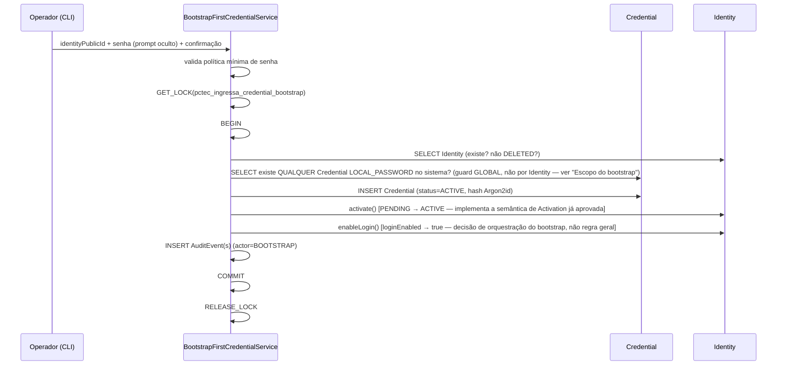

# ADR-029 — Credential e Autenticação (Fase C da ADR-027)

## Nota de revisão crítica (segunda rodada, antes do commit)

Uma revisão crítica do Platform Architect identificou correções reais
necessárias na primeira versão desta ADR. Registradas explicitamente,
sem reescrever silenciosamente o que já estava certo:

1. **Semântica de `ACTIVE`** — a primeira versão tratou isso como uma
   decisão nova a formalizar. Na verdade, `IDENTITY-UBIQUITOUS-LANGUAGE.md`
   **já define** `Activation` com precisão desde a v0.3.0: "processo pelo
   qual uma `Identity` em `PENDING` recebe sua primeira `Credential` e
   transita para `ACTIVE`... `Activation` não é sinônimo de `Login
   Enabled = true`... normalmente ocorrem em conjunto [mas não
   necessariamente]." Esta ADR **não inventa** semântica nova — apenas
   implementa a que já estava aprovada.
2. **`loginEnabled` não é automático** — a primeira versão fazia
   `enableLogin()` sempre acompanhar `activate()` na mesma transação,
   tratando isso como regra geral. Corrigido: `Credential ACTIVE +
   loginEnabled = false` é um estado válido e esperado; a ativação
   automática de login é uma escolha **específica do fluxo de bootstrap**,
   não um invariante de domínio.
3. **Unicidade de Credential ativa** — a primeira versão rejeitou
   `UNIQUE(identity_public_id, type)` assumindo um modelo de múltiplas
   linhas históricas. Corrigido: adotada estratégia de **atualização em
   lugar** (uma única linha por identidade+tipo, `password_hash`
   sobrescrito na rotação), o que torna `UNIQUE(identity_public_id, type)`
   não apenas viável, mas a escolha correta — garantida pelo banco, não
   por check-then-act.
4. **Escopo do bootstrap** — a primeira versão guardava contra "esta
   Identity já tem Credential", o que permitiria rodar o CLI
   indefinidamente para identidades diferentes — exatamente o "CLI
   administrativo permanente" que não queremos. Corrigido: guard **global**
   ("já existe qualquer `Credential LOCAL_PASSWORD` no sistema?"), mesmo
   padrão estrutural de ADR-027/028, sem hardcode de UUID.
5. **`AuthenticatedPrincipal` acoplava autenticação e autorização** —
   corrigido: `AuthenticateIdentityService` retorna só a identidade
   provada; `ApplicationAccess` é resolvido depois, por chamada separada.
6. Proteção contra enumeração de usuário formalizada explicitamente
   (não estava no desenho original).

Ver seções correspondentes abaixo, cada uma já com o conteúdo corrigido.

## Contexto

A ADR-027 previu quatro fases: A (bootstrap de Identity, concluída no DEV
real), B (`ApplicationAccess` administrativo, concluída no DEV real), C
(`Credential`/autenticação — esta ADR), D (primeiro login administrativo,
fora de escopo). `Credential` já existe como conceito documentado desde a
v0.3.0 (`MODELO-DE-DOMINIO.md`, seção 9; ADR-022), mas nenhuma linha de
código existe ainda.

Esta ADR resolve exclusivamente o desenho da Fase C: o modelo de
`Credential`, como a primeira credencial nasce, o algoritmo de hash, a
relação entre `Credential` e a transição `PENDING → ACTIVE`/`loginEnabled`,
e o boundary conceitual do login futuro (Fase D). **Nenhum código é
implementado nesta entrega** — é desenho puro, mesmo padrão já seguido
pela v0.3.0 (Identity Domain Design) antes da v0.4.0 implementar.

## Conflito real encontrado — resolvido nesta ADR

**ADR-022 declara:** "a criação da primeira `Credential` é sempre
consequência de um fluxo de `MagicLink` do tipo `ACTIVATION` consumido com
sucesso... nunca um atributo definido na criação da `Identity`."

A task desta entrega propõe um `BootstrapFirstCredentialService` via CLI
local, one-shot — que **não** passa por `MagicLink`. Isso contraria a
letra do ADR-022 como estava escrita.

**Resolução:** o mesmo problema estrutural já apareceu, e já foi
resolvido, na Fase A (ADR-027) — a Identity fundacional não podia nascer
pelo fluxo normal (que exigiria um `Actor` autenticado já existente),
então um bootstrap CLI explícito, one-shot, auditável, foi formalizado
como **exceção deliberada e documentada** ao fluxo normal. A mesma lógica
se aplica aqui: `MagicLink` depende de envio de e-mail (infraestrutura de
notificação inexistente) e de toda a infraestrutura de `security` que
ainda não tem uma linha de código — exigir que a *primeira* `Credential`
da plataforma nasça por `MagicLink` é uma dependência circular
(precisaríamos de `Credential`/autenticação funcionando para operar o
sistema que cria a primeira `Credential`).

**Decisão formal:** ADR-022 permanece válida como a **regra geral** —
toda `Credential` subsequente (após a primeira) nasce por `MagicLink`
`ACTIVATION`, quando esse fluxo existir. A **primeira** `Credential` da
plataforma é uma **exceção de bootstrap**, explícita e auditável, mesmo
padrão do ADR-027: CLI local, one-shot, actor `BOOTSTRAP`, nunca reutilizável
depois de consumida. ADR-022 é atualizada (nota de correção, não reescrita)
para registrar essa exceção, sem contradizer a regra geral.

## Questões respondidas (task, seção 26)

### 1. O que é `Credential` no Ingressa?

O mecanismo de autenticação de uma `Identity` — nesta fase, exclusivamente
senha local (`type = LOCAL_PASSWORD`, nome preservado de ADR-022/v0.3.0,
não renomeado para `PASSWORD` como a task sugeriu — ver seção "Nomenclatura
de `type`" abaixo). `Credential` responde "como esta pessoa prova quem é",
nunca "quem ela é" (`Identity`) nem "o que ela pode acessar"
(`ApplicationAccess`) — ver seção "Relação com ADMIN/Authentication" mais
abaixo.

### 2. Ela referencia Identity como?

Por `identity_public_id` (referência direta ao `public_id` de `Identity`,
mesmo padrão já estabelecido para `ApplicationAccess` desde ADR-025/028) —
nunca por `internal_id`, nunca por `IdentityProfile` (que não existe mais,
ADR-025).

### 3. O login usa e-mail da Identity ou campo próprio?

**Resolvido: e-mail da `Identity`, nunca duplicado em `Credential`.**
`Credential` **não** tem um campo `loginIdentifier` próprio — o
identificador de login é sempre resolvido a partir de
`identities.email_normalized` no momento da autenticação (Fase D). O
modelo mínimo de `Credential` (seção "Modelo recomendado" abaixo) **não
inclui** `loginIdentifier` como coluna.

**Auditoria de consequências (revisão crítica, item 5):**

- **Mudança de e-mail:** `Identity.confirmEmailChange()` já existe
  (v0.4.0) e atualiza `email`/`email_normalized` diretamente em
  `identities`. Como `Credential` nunca copia o e-mail, a mudança tem
  efeito imediato no login — sem nenhuma sincronização a fazer, sem
  janela de inconsistência entre "e-mail de login" e e-mail real.
- **Unicidade:** já garantida por `UNIQUE KEY uk_identities_email_normalized`
  (v0.4.0) — a consulta de login sempre resolve, no máximo, uma
  `Identity`.
- **Normalização:** a mesma função de normalização já usada por
  `Email.normalized()` (lowercase) é a única usada também na consulta de
  login — nenhuma lógica de normalização duplicada ou divergente.
- **Lookup de autenticação (Fase D, desenho apenas):** `SELECT identities
  WHERE email_normalized = ?` → se encontrada, `SELECT credentials WHERE
  identity_public_id = ? AND type = 'LOCAL_PASSWORD' AND status =
  'ACTIVE'` → verificar hash. Duas consultas (ou um `JOIN`); sem
  problema de desempenho identificado nesta escala.
- **Credential de Microsoft/Entra futura:** e-mail continua sendo o
  identificador de descoberta **apenas para `type = LOCAL_PASSWORD`**.
  Um futuro `type = MICROSOFT_ENTRA` não usaria e-mail/senha (fluxo
  OAuth/redirect) — precisaria de seu próprio identificador
  type-específico (ex.: `external_subject_id`), **não desenhado agora**
  (a task pediu explicitamente para não inventar campos de OAuth/Entra
  antes da hora — ver seção "Migration futura"). Isso confirma: e-mail
  não é "o identificador de login genérico de toda `Credential`" — é
  especificamente o mecanismo de descoberta para o `type`
  `LOCAL_PASSWORD`.
- **Identity sem e-mail:** não é um cenário possível — `email` é
  obrigatório em `Identity` desde ADR-009. Não exige tratamento especial.
- **Múltiplas Credentials/providers:** uma `Identity` pode ter, no
  futuro, `LOCAL_PASSWORD` **e** `MICROSOFT_ENTRA` simultaneamente —
  `UNIQUE(identity_public_id, type)` (ver seção "Rotação de senha e
  unicidade" abaixo) permite exatamente um `Credential` por combinação
  identidade+tipo, múltiplos tipos coexistem sem conflito.

**Confirmação final:** e-mail é atributo de `Identity`, usado por
`Credential` (`type=LOCAL_PASSWORD`) apenas como mecanismo de descoberta
no momento do login — nunca uma identidade própria da `Credential`.

### 4. Qual algoritmo de hash?

**Família do algoritmo: Argon2id — decisão arquitetural fechada nesta
ADR.** Parâmetros concretos: **não congelados aqui** (revisão crítica,
item 6). Detalhamento:

- **Algoritmo:** Argon2id (não Argon2i nem Argon2d isoladamente — a
  variante "id" combina resistência a ataques de canal lateral e a
  ataques de otimização por GPU/ASIC, recomendação padrão da indústria
  para hashing de senha).
- **Parâmetros de custo** (`memoryCost`, `timeCost`, `parallelism`):
  **não definidos nesta ADR.** Requerem benchmark no ambiente de
  produção real (hardware do servidor, latência aceitável por
  requisição) antes de serem fixados — decisão de implementação, feita
  quando o código for escrito, não arquitetura.
- **Benchmark obrigatório antes de produção:** qualquer valor de
  parâmetro usado em desenvolvimento/teste não deve ser assumido como
  adequado para produção sem medição real de tempo de hash no hardware
  de destino.
- **Formato de armazenamento:** o hash **PHC completo** é persistido em
  `password_hash` (formato autodescritivo, ex.:
  `$argon2id$v=19$m=...,t=...,p=...$<salt>$<hash>`) — não uma coluna
  separada de salt nem de parâmetros. O salt é gerado e administrado
  pela própria biblioteca de Argon2id (nunca gerado/armazenado
  manualmente pelo domínio) e vem embutido na string PHC.
- **Rehash futuro:** como o PHC string é autodescritivo, é estruturalmente
  possível, no futuro, comparar os parâmetros embutidos no hash
  armazenado com os parâmetros-alvo atuais no momento de um login
  bem-sucedido, e re-hashear transparentemente se divergentes ("rehash on
  login") — desenho da Fase D, não implementado agora, mas o schema já
  comporta isso sem migração futura (nenhuma coluna adicional de
  parâmetros precisa existir separadamente).
- **Biblioteca específica** (`argon2`, `@node-rs/argon2`, etc.)
  permanece Pendente de decisão — escolha de biblioteca é implementação,
  feita quando o código for escrito. `bcrypt` seria uma alternativa
  aceitável, mas Argon2id é preferido por resistência superior a ataques
  com hardware dedicado.

### 5. Como nasce a primeira Credential?

Por `BootstrapFirstCredentialService`, CLI local
(`npm run bootstrap:first-credential`), one-shot — ver seção "Primeiro
credenciamento" abaixo.

### 6. Quem é o actor dessa operação?

O mesmo padrão de ADR-027/028: `Credential.grantedByIdentityPublicId`
(ou equivalente — ver modelo) não existe como conceito em `Credential`
(diferente de `ApplicationAccess`, `Credential` não tem "quem concedeu",
porque é a própria pessoa definindo sua senha, não uma concessão de
terceiro) — mas o `AuditEvent` gerado tem `actor_public_id = "BOOTSTRAP"`,
mesmo marcador reservado já usado em ADR-027/028, pela mesma razão: não
existe um `Actor` autenticado real nesta operação.

### 7. Quando Identity vira ACTIVE?

**Semântica de `ACTIVE` — já definida, não inventada aqui (revisão
crítica, item 1).** `IDENTITY-UBIQUITOUS-LANGUAGE.md`, termo `Activation`
(v0.3.0), já diz: "processo pelo qual uma `Identity` em `PENDING` recebe
sua primeira `Credential` e transita para `ACTIVE`, mediado por um
`MagicLink` do tipo `ACTIVATION` consumido com sucesso." Ou seja:
**`ACTIVE` significa especificamente "a identidade recebeu sua primeira
`Credential` (passou pelo processo de Ativação)"** — não significa
genericamente "verificada", nem "cadastro concluído" em sentido amplo,
nem diretamente "pode autenticar" (isso é `loginEnabled`, dimensão
separada — ver questão 8). É uma semântica **estreita e específica**,
ligada à existência da primeira credencial.

O mesmo termo já registra explicitamente: "`Activation` não é sinônimo de
`Login Enabled = true` — são eventos relacionados, mas conceitualmente
distintos; ativação trata da transição de estado e da primeira
credencial, não da habilitação de login em si (embora normalmente ocorram
em conjunto)." E a definição de `Identity Status` já traz um exemplo
consistente com essa distinção: "um colaborador pré-cadastrado, `ACTIVE`,
mas com `Login Enabled = false`, ainda não pode fazer login."

**Decisão confirmada (não nova, apenas implementada):** a criação da
primeira `Credential` **é** a Ativação — logo, `identity.activate()` deve
ser chamado como parte do bootstrap. Isso já era coerente com o
lifecycle existente; a primeira versão desta ADR só não havia
identificado a fonte formal já aprovada.

### 8. Quando loginEnabled vira true?

**Corrigido (revisão crítica, item 2) — não é automático como regra
geral.** A primeira versão desta ADR tratava `enableLogin()` como
consequência automática de toda criação de `Credential`. Isso está
errado como regra geral: a própria `IDENTITY-UBIQUITOUS-LANGUAGE.md` já
mostra `ACTIVE + Login Enabled = false` como estado válido e esperado
("normalmente ocorrem em conjunto", não sempre).

**Duas direções da invariante, distintas (task, seção 2):**

- **(A) `loginEnabled = true` exige `Credential` `ACTIVE` existente.**
  Adotada como invariante de processo (não de domínio dentro do
  agregado `Identity` — ver questão 10) — nunca deveria ser possível
  habilitar login sem nenhuma credencial capaz de autenticar.
- **(B) Existir `Credential` `ACTIVE` implica `loginEnabled = true`.**
  **Rejeitada.** `Credential ACTIVE` representa capacidade de provar
  identidade; `loginEnabled` representa uma decisão administrativa
  separada de permitir autenticação. Uma `Identity` pode ter uma
  `Credential` `ACTIVE` válida e, ainda assim, `loginEnabled = false`
  (ex.: suspensão administrativa temporária de acesso, sem revogar a
  credencial em si — permite reverter a suspensão sem forçar o usuário a
  redefinir a senha).

**Consequência prática para o bootstrap especificamente:** o
`BootstrapFirstCredentialService` **decide explicitamente** habilitar
login imediatamente após criar a credencial (`activate()` +
`enableLogin()` na mesma transação) — mas essa é uma **escolha de
orquestração deste serviço específico** (a Identity fundacional precisa
de um login administrativo funcional imediatamente após o bootstrap, não
há razão para reter isso), **não** uma regra de domínio de que toda
criação de `Credential` sempre habilita login. Um comando futuro de
"criar Credential para um usuário comum" (fora do fluxo de bootstrap,
Fase D+) poderia, por exemplo, criar a credencial sem chamar
`enableLogin()`, deixando essa decisão para um passo administrativo
separado — o desenho desta ADR permite isso sem alteração de `Identity`.

**Quem controla:** exclusivamente Application Services que orquestram um
evento de segurança real — nunca via API pública direta setando o campo
arbitrariamente (ver seção "loginEnabled — invariante e controle"
abaixo, mantida).

### 9. Pode existir Credential com Identity PENDING?

**Sim, momentaneamente é impossível observar por fora (isolamento de
transação), mas a pergunta merece precisão:** se a pergunta for "pode uma
`Credential` existir associada a uma `Identity` que permanece `PENDING`
*depois* da transação de criação terminar" — na Fase C (fluxo de
bootstrap), não: a criação da `Credential` e `activate()` acontecem
atomicamente na mesma transação (mesmo padrão de atomicidade de
ADR-027/028: uma única conexão, um único `BEGIN`/`COMMIT`). A ordem
interna é: `INSERT Credential` → `activate()` → (opcionalmente
`enableLogin()`, ver questão 8) → `INSERT AuditEvent(s)` → `COMMIT`.

Mas isso é uma característica **deste fluxo específico de bootstrap**,
não uma invariante de domínio que impeça estruturalmente uma
`Credential` de existir para uma `Identity` `PENDING` em outro fluxo
futuro (ex.: um cadastro que gera a credencial antes de confirmar
e-mail, por algum motivo de UX ainda não desenhado) — `Credential` não
consulta nem depende de `Identity.status` para ser criada, por
isolamento de agregado (mesmo raciocínio da questão 10).

### 10. Pode existir Identity ACTIVE sem Credential?

Estruturalmente, o código não impede isso — `activate()` é um comando
genérico que qualquer chamador futuro poderia invocar sem uma `Credential`
existir (ex.: uma futura ativação por outro motivo administrativo, se tal
motivo vier a existir). Esta ADR não adiciona uma checagem de domínio
dentro de `Identity.activate()` que exija `Credential` existente, porque
isso acoplaria o agregado `Identity` ao agregado `Credential` (violação
de isolamento de agregado, mesmo princípio já respeitado para
`ApplicationAccess` — ADR-025/028 nunca fizeram `Identity` consultar
`ApplicationAccess` para se auto-validar).

A invariante "`ACTIVE` normalmente implica `Credential` existente" é uma
invariante de **processo** (garantida pelo `BootstrapFirstCredentialService`
orquestrando as duas coisas juntas), não uma invariante de **domínio**
imposta dentro do agregado `Identity`. Registrado como decisão consciente,
não omissão — mesmo padrão já usado para a invariante de unicidade de
`ApplicationAccess` `ADMIN` (ADR-028, "Garantias de unicidade").

### 11. Como ADMIN participa do login?

**Não participa do login em si.** `ApplicationAccess` (incluindo
`accessProfile=ADMIN`) responde "o que esta identidade pode acessar",
nunca "ela está autenticada". O login (Fase D) resolve exclusivamente
`Credential` → `Identity`; a resolução de `ApplicationAccess` acontece
**depois**, como uma consulta separada (ver "Authentication boundary"
abaixo — `AuthenticatedPrincipal` inclui `applicationAccesses` como dado
carregado, não como parte do processo de autenticação em si).

### 12. O que entra na Fase D?

`POST /api/v1/sessions` (reaproveitando o contrato conceitual já existente
desde v0.2.0 — ver "Contrato futuro de login" abaixo) — validação de
`Credential`, emissão de sessão/token, JWT ou equivalente (mecanismo ainda
Pendente de decisão), rate limiting/lockout (deferidos, ver seção 16 do
prompt), refresh token. Nada disso é implementado nesta ADR.

### 13. Quais migrations serão necessárias?

Nesta entrega: **nenhuma** (task, seção 25 — só desenho). Quando a Fase C
for implementada em código: uma migration `CREATE TABLE credentials`,
seguindo a mesma convenção `id BIGINT` interno + `public_id CHAR(36)`
externo (ADR-021) já aplicada a `identities`/`applications`/
`application_accesses` — divergindo da convenção `BINARY(16)` ainda
registrada em `MODELO-RELACIONAL-PROPOSTO.md` v0.2.0 para `credentials`
(mesma correção já feita 3 vezes antes, será feita de novo quando
implementada).

### 14. Quais erros/eventos faltam?

Ver seções "Eventos" e "Erros" abaixo — `credential.created` e
`identity.login-enabled`/`identity.activated` (estes dois **já existem**
no catálogo e no código desde v0.2.0/v0.4.0, reutilizados sem alteração).
`authentication.succeeded`/`authentication.failed` são eventos da Fase D,
não desta.

### 15. Quais decisões permanecem abertas?

Biblioteca específica de Argon2id; parâmetros de custo do hash; política
de lockout/rate limiting (deferida, seção "Lockout" abaixo); mecanismo de
sessão/token da Fase D; migração de algoritmo de hash no futuro; troca e
reset de senha (comandos não desenhados nesta ADR — fora de escopo,
mencionado apenas como risco mapeado).

## Nomenclatura de `type` — PASSWORD vs. LOCAL_PASSWORD

A task sugeriu `type = PASSWORD`. O modelo já aprovado (ADR-022,
`MODELO-DE-DOMINIO.md` v0.3.0) usa `LOCAL_PASSWORD`. **Decisão: preservar
`LOCAL_PASSWORD`**, não renomear. Justificativa: já é uma decisão
aprovada e documentada há duas entregas; `LOCAL_PASSWORD` é mais explícito
sobre a natureza do mecanismo (autenticação local ao Ingressa, por
oposição a um provedor externo futuro como `MICROSOFT_ENTRA`) — renomear
sem necessidade violaria a diretriz de não alterar documentos aprovados
para acomodar uma preferência de nomenclatura sem ganho real. O enum
permanece extensível (`LOCAL_PASSWORD` hoje; `MICROSOFT_ENTRA`, outros
provedores, no futuro — sem quebrar `Identity`, que nunca conhece o
`type`).

## Modelo recomendado de Credential

| Atributo | Adotado? | Justificativa |
|---|---|---|
| `id` (interno, BIGINT) | Sim | Convenção ADR-021. |
| `publicId` (CHAR(36)) | Sim | Convenção ADR-021. |
| `identityPublicId` | Sim | Referência direta, mesmo padrão de ApplicationAccess. |
| `type` | Sim | `LOCAL_PASSWORD` nesta fase (enum extensível). |
| `loginIdentifier` | **Não adotado** | Resolvido via `Identity.email_normalized` — ver questão 3. |
| `passwordHash` | Sim | Formato PHC completo do Argon2id (salt embutido). |
| `status` | Sim | Só `ACTIVE`/`REVOKED` — ver seção "Status de Credential" abaixo. |
| `failedAttempts` | **Deferido** | Ver seção "Lockout" abaixo — fora de escopo desta fase. |
| `lockedUntil` | **Deferido, mas já desenhado como campo, não status** | Ver "Status de Credential" abaixo — quando implementado, é um campo temporal na própria linha `ACTIVE`, nunca um valor de `status`. |
| `lastAuthenticatedAt` | Sim, nullable | Coluna conceitual reservada; não populada por nenhum comando desta fase (só a Fase D, login, a populará). |
| `version` | Sim | Optimistic locking, ADR-024. |
| `createdAt`/`updatedAt` | Sim | Padrão. |

## Status de Credential (revisão crítica, item 3)

**Lifecycle mínimo: apenas `ACTIVE` e `REVOKED`.** `PENDING`, `LOCKED` e
`DISABLED` foram avaliados e **não adotados** como valores de `status`:

- **`PENDING` como status de Credential:** rejeitado — misturaria o
  conceito de "credencial ainda não confirmada" (que já pertence ao
  `MagicLink`, não à `Credential` em si — uma `Credential` só passa a
  existir quando o `MagicLink` de ativação já foi consumido com sucesso,
  ADR-022) com o lifecycle da própria `Credential`. Não há estado
  intermediário de `Credential` "pendente" nesta ADR.
- **`LOCKED` como status:** rejeitado. Um lock temporário por tentativas
  de senha incorretas (se/quando implementado — ver "Lockout" abaixo) é
  uma condição **temporal e reversível automaticamente** (expira
  sozinha), diferente de `REVOKED` (decisão deliberada e permanente até
  nova ação administrativa). Modelar isso como um terceiro valor de
  `status` misturaria dois conceitos distintos: "esta credencial é
  válida" (`status`) vs. "esta credencial está temporariamente
  impedida de ser usada agora" (`locked_until`, um campo, não um estado).
  Uma `Credential` `ACTIVE` com `locked_until` no futuro continua
  `ACTIVE` — só não pode ser usada para autenticar até esse instante
  passar.
- **`DISABLED` como status:** rejeitado como redundante — `REVOKED` já
  cobre "esta credencial não deve mais ser aceita para autenticação",
  não há necessidade semântica de um segundo valor com o mesmo
  significado prático.

## Rotação de senha e unicidade de Credential ativa (revisão crítica, item 4)

**Corrigido em relação à primeira versão** desta ADR, que havia rejeitado
`UNIQUE(identity_public_id, type)` assumindo um modelo de múltiplas
linhas históricas (opção B abaixo). Reavaliado:

| Opção | Descrição | Adotada? |
|---|---|---|
| A. Atualização em lugar | Uma única linha por `(identity, type)`; rotação = `UPDATE password_hash` na mesma linha, com `version` incrementada (optimistic locking). | **Sim** |
| B. Múltiplas linhas históricas + uma `ACTIVE` | Cada rotação cria uma nova linha `ACTIVE`, a anterior vira `REVOKED`; exige unicidade condicional (`status=ACTIVE`), que o MariaDB não suporta nativamente sem coluna gerada. | Não |
| C. Tabela separada de histórico de hashes | `credentials` (atual) + `credential_password_history` (append-only, para checagem futura de reuso de senha). | Não, nesta fase — extensão futura possível, não desenhada agora |
| D. Outra | — | — |

**Decisão: Opção A.** Existe **uma única linha** de `Credential` por
`(identity_public_id, type)`, para sempre — rotacionar a senha é um
`UPDATE` na mesma linha (`password_hash`, `version += 1`,
`updated_at`), nunca um `INSERT` de uma nova linha. "Revogar" uma
credencial (sem apagar o histórico de que ela existiu) é setar
`status = REVOKED` **na mesma linha** — reabilitar exigiria uma nova
operação que volta `status` para `ACTIVE` (com uma nova senha, tipicamente
via fluxo de reset — não desenhado nesta ADR).

**Isso resolve a unicidade sem depender de check-then-act:**
`UNIQUE(identity_public_id, type)` (incondicional, sem necessidade de
coluna gerada) garante, no nível do banco, que nunca existam duas linhas
de `Credential` `LOCAL_PASSWORD` para a mesma `Identity` — porque só
existe (e sempre existiu) no máximo uma linha por combinação, ponto.
**Correção explícita:** a rejeição de `UNIQUE(identity_public_id, type)`
na primeira versão desta ADR estava certa **para o modelo B** (que não foi
adotado), mas errada para o modelo A (que é o adotado agora) — registrado
aqui como correção, não como contradição silenciosa.

**Extensão futura (não desenhada agora):** se o produto precisar de
"impedir reuso das últimas N senhas", isso exigiria a Opção C (tabela de
histórico separada, append-only) como um complemento — não uma mudança
na tabela `credentials` em si.

## Lifecycle



## `loginEnabled` — invariante e controle

**Quem controla a transição:** exclusivamente Application Services que
orquestram um evento de segurança real — nesta fase, apenas
`BootstrapFirstCredentialService`. **Nunca via API pública direta** —
não existe (e não deve existir) um endpoint que sete `loginEnabled`
arbitrariamente; ele é sempre efeito colateral de uma operação
deliberada.

**Invariante corrigida (revisão crítica, item 2 — ver questão 8
acima para a análise completa):**

- `loginEnabled = true` **exige** `Credential ACTIVE` existente
  (direção A) — invariante de processo, não de domínio (mesmo raciocínio
  da questão 10, evitar acoplamento entre agregados `Identity` e
  `Credential`).
- `Credential ACTIVE` existente **não implica** `loginEnabled = true`
  (direção B, explicitamente rejeitada) — `Credential ACTIVE +
  loginEnabled = false` é um estado válido (ex.: suspensão administrativa
  temporária sem revogar a credencial).
- Para o **bootstrap especificamente**, a orquestração decide habilitar
  login imediatamente — decisão local deste serviço, não regra geral de
  domínio.

## Escopo exato do bootstrap (revisão crítica, item 7 — correção mais importante desta rodada)

**A primeira versão desta ADR guardava "esta Identity já tem
Credential?" — um guard *por identidade*, que permitiria rodar o CLI
indefinidamente, uma vez por identidade diferente, para sempre. Isso é
exatamente o "CLI administrativo permanente que contorna `MagicLink` para
qualquer usuário futuro" que a task explicitamente pediu para evitar.
Corrigido.**

**Semântica escolhida: exceção global, não vinculada a uma Identity
específica (nem hardcoded, nem por parâmetro).** O guard é: **"já existe
alguma `Credential` do tipo `LOCAL_PASSWORD` em todo o sistema,
independente de qual `Identity`?"** — não "esta identidade já tem uma".
Mesma lógica estrutural do guard de bootstrap de Identity (ADR-027:
`COUNT(identities) = 0`, não "esta pessoa específica já existe") e do
guard de ApplicationAccess (ADR-028: "existe `ADMIN` para esta
aplicação?", não vinculado a uma `Identity` fixa).

**Consequência prática:** na prática, dado que a plataforma hoje só tem a
Identity fundacional, este guard tem o mesmo efeito de "só a Identity
fundacional pode usar este CLI" — mas **estruturalmente**, sem hardcode
de UUID, sem acoplar o guard a uma identidade específica. Depois que a
**primeira** `Credential LOCAL_PASSWORD` for criada por qualquer
identidade, o CLI fica **permanentemente inutilizável** para qualquer
identidade futura — nunca se torna um mecanismo geral de contornar
`MagicLink`.

- CLI local, one-shot: `npm run bootstrap:first-credential`.
- Entrada: `identityPublicId`, senha via prompt **oculto** (nunca eco no
  terminal), confirmação de senha (comparação exata antes de prosseguir).
- **Nunca** aceita senha via argv (mesmo princípio do CLI de bootstrap de
  Identity/ApplicationAccess — argv aparece em `ps`/histórico de shell).
- **Nunca** imprime a senha, o hash, ou qualquer derivado reversível.
- Named lock dedicado: `pctec_ingressa_credential_bootstrap` (nome
  próprio, não reaproveita os locks de Identity/ApplicationAccess).
- Mesma conexão física do início ao fim; `BEGIN` único; `COMMIT`/`ROLLBACK`
  único; `RELEASE_LOCK` sempre depois de `COMMIT`/`ROLLBACK`;
  `connection.release()` sempre por último — mesma prova de atomicidade já
  estabelecida para os dois bootstraps anteriores.
- **Guards antes de criar:**
  - `Identity` deve existir (`IDENTITY_NOT_FOUND` se não).
  - `Identity.status` não pode ser `DELETED` (`IDENTITY_DELETED`, erro já
    existente).
  - **Guard global, corrigido:** não pode existir **nenhuma** `Credential`
    `LOCAL_PASSWORD` em todo o sistema, de nenhuma identidade
    (`CredentialBootstrapAlreadyCompletedError`, nome de erro alinhado
    com o mesmo padrão de `ApplicationAccessBootstrapAlreadyCompletedError`)
    — não mais "para esta Identity" como a primeira versão desta ADR
    definia incorretamente.
  - Senha deve cumprir a política mínima (ver "Password Policy" abaixo).
- **Não reutiliza o bootstrap de Identity** — são serviços e CLIs
  inteiramente separados, como a task exigiu.

### Garantias de unicidade — reconciliado com a Opção A de rotação

Com a Opção A adotada (uma única linha por `identity_public_id + type`,
ver seção "Rotação de senha e unicidade" acima), a análise de garantias
muda em relação à primeira versão desta ADR:

- **A unicidade "no máximo uma `Credential LOCAL_PASSWORD` por
  Identity"** — agora é garantida **pelo banco**
  (`UNIQUE(identity_public_id, type)`), não apenas por check-then-act.
  Correção em relação à primeira versão.
- **O guard *global* de bootstrap** ("nenhuma `Credential LOCAL_PASSWORD`
  existe em lugar nenhum ainda") continua dependendo da mesma análise
  A/banco, B/service, C/lock já usada em ADR-028: (A) o banco não tem
  constraint nativa para "a tabela inteira está vazia para este `type`"
  — isso não é expressável como `UNIQUE`; (B) o service verifica dentro
  da transação; (C) a proteção real contra duas execuções concorrentes
  do bootstrap (ambas rodando quando a tabela ainda está vazia) depende
  do named lock cooperativo. Mesma honestidade já registrada em ADR-028:
  o lock protege quem passa por `BootstrapFirstCredentialService`, não
  qualquer inserção futura em `credentials` que não passe por ele.

## Password Policy

**Adotado:** comprimento mínimo (recomendado: 12 caracteres) + checagem
contra lista de senhas comprometidas/comuns (blacklist, ex.: baseada em
"top N senhas vazadas" — fonte específica da lista é Pendente de decisão
de implementação). **Não adotado:** regras artificiais de composição
("1 maiúscula, 1 símbolo, 1 número") — evidência de UX/segurança
(NIST 800-63B) mostra que essas regras não melhoram segurança real e
incentivam padrões previsíveis. Comprimento + blacklist é a recomendação
desta ADR. Expiração/troca periódica forçada: **não adotada** — mesma
evidência do NIST desaconselha expiração arbitrária sem indício de
comprometimento.

## Lockout — deferido, explicitamente fora de escopo

`failedAttempts`/`lockedUntil` (colunas), rate limiting e lock temporário
são **deferidos para uma fase futura própria**, não esta. Justificativa:
(a) esta ADR desenha só a *criação* da primeira credencial, não o *login*
em si (Fase D) — lockout só faz sentido quando há tentativas reais de
autenticação a contar; (b) rate limiting robusto tipicamente depende de
infraestrutura (contador distribuído) que a stack aprovada explicitamente
recusa nesta fase (sem Redis, decisão da v0.4.0); um contador só-em-banco
é possível mas tem trade-offs (contenção de linha) que merecem desenho
próprio, não uma decisão apressada aqui.

## Authentication boundary (Fase D, desenho apenas)

**Corrigido (revisão crítica, item 12) — `AuthenticatedPrincipal` da
primeira versão acoplava autenticação e autorização.**
`AuthenticateIdentityService` prova **exclusivamente** quem a pessoa é —
nunca decide `ApplicationAccess`/`ADMIN`. Renomeado e simplificado:

```
AuthenticateIdentityService.execute({ email, password }): Promise<AuthenticatedIdentity>

AuthenticatedIdentity {
  identityPublicId: string;
}
```

`applicationAccesses` **removido** do retorno deste serviço. A resolução
de "o que esta identidade pode acessar" é uma chamada **separada e
subsequente** (`ApplicationAccessRepository`, já implementado desde
v0.5.0), feita pela camada de orquestração de sessão (Fase D — emissão de
sessão/token), nunca pelo próprio `AuthenticateIdentityService`. Isso
preserva a separação já estabelecida pela seção "Relação com
ADMIN/Authentication" abaixo: autenticação prova identidade; autorização
é resolvida depois, por um passo distinto.

Nunca recebe `Express.Request`/`Response` — apenas primitivas (`email`,
`password`), mesmo princípio já seguido pelos serviços de bootstrap desta
base de código (nenhum deles conhece HTTP). O mapeamento HTTP → chamada
deste serviço é responsabilidade da camada de rotas (Fase D, não
desenhada em detalhe aqui).

## Relação com ADMIN/Authentication — separação formal (task, seção 23)

| Pergunta | Quem responde |
|---|---|
| "Quem é a pessoa?" | `Identity` |
| "Como ela prova quem é?" | `Credential`/`AuthenticateIdentityService` |
| "O que ela pode acessar?" | `ApplicationAccess`, resolvido **depois** da autenticação, por chamada separada |

Nenhum desses três conceitos decide pelos outros dois. `Credential` válida
não implica acesso a nenhuma aplicação; `ApplicationAccess` concedido não
implica capacidade de autenticar; `Identity` existente não implica nem
uma coisa nem outra. `AuthenticateIdentityService` especificamente **não
deve** consultar `ApplicationAccessRepository` — essa é uma
responsabilidade de outro componente (Fase D).

## Proteção contra enumeração de usuário (revisão crítica, item 10 — novo)

**Contrato HTTP externo deve ser indistinguível para todas as causas de
falha de autenticação:** e-mail inexistente, senha incorreta, `Credential`
inexistente, `Credential` `REVOKED`, `Identity` sem `loginEnabled`. Todas
essas condições devem produzir a **mesma** resposta externa (mesmo código
de erro, mesmo HTTP status, idealmente características de tempo de
resposta semelhantes) — nunca revelar qual condição específica ocorreu,
para não permitir que um atacante confirme se um e-mail está cadastrado
na plataforma (enumeração de usuário) nem colete sinais sobre o motivo
exato da rejeição.

**Consequência para o catálogo de erros (Fase D):** os erros
`CREDENTIAL_INVALID_PASSWORD`, `CREDENTIAL_LOCKED`,
`IDENTITY_LOGIN_NOT_ENABLED`, `IDENTITY_NOT_ACTIVE` — listados
conceitualmente pela task — **não devem ser expostos individualmente na
resposta HTTP externa** de `POST /api/v1/sessions`. Todos devem colapsar
para um único código externo genérico (`AUTHENTICATION_FAILED` ou
equivalente ao já catalogado `INVALID_CREDENTIALS`), com o mesmo HTTP
`401`. **Internamente** (auditoria, telemetria, `AuditEvent` de
`authentication.failed`), o motivo real pode e deve ser distinguido — a
indistinguibilidade é uma propriedade do **contrato externo**, não da
capacidade de diagnóstico interna. Este comportamento é formalizado como
requisito de desenho agora, mesmo sem implementação, para que a Fase D não
seja desenhada de forma insegura por omissão.

## Contrato futuro de login (boundary apenas, task seção 22)

**Confirmado (revisão crítica, item 11): permanece `POST
/api/v1/sessions`**, não `/api/v1/auth/login`. A task pediu confirmação
explícita desta rodada — reafirmado sem alteração: `API-CONTRACT-V1.md`
já define esse endpoint com o propósito conceitual correto desde a
v0.2.0. Criar um segundo endpoint redundante fragmentaria o contrato de
API sem necessidade.

**Explicitamente não definido nesta ADR** (nem na primeira versão, nem
nesta revisão): `JWT`, formato/mecanismo de refresh token, uso de cookie
vs. corpo de resposta, duração de sessão, armazenamento de sessão —
`API-CONTRACT-V1.md` já registra tudo isso como "Pendente de decisão"
desde v0.2.0, e continua assim. Fase C prepara a autenticação (`Credential`
existe, pode ser verificada); Fase D decide e emite a sessão em si —
nenhuma dessas decisões é antecipada aqui.

## Eventos

**Reutilizados sem alteração** (já existem no catálogo desde v0.2.0 e no
código desde v0.4.0): `identity.login-enabled`, `identity.activated`.

**Novo, a formalizar:** `credential.created` — distinto de
`credential.changed` (já catalogado, reservado para alterações a uma
credencial existente, ex.: troca de senha futura). Payload mínimo:
`credential_public_id`, `identity_public_id`, `type`, `correlation_id`,
`causation_id`, `actor_public_id`, `occurred_at`. **Nunca publicar (item
9, revisão crítica — confirmado, sem alteração de conteúdo, apenas
reafirmado):** senha em qualquer forma, `password_hash`, salt,
parâmetros do algoritmo de hash, ou qualquer outro dado secreto derivado
da senha. O payload contém apenas identificadores e metadados não
secretos.

**Actor e redundância dos três eventos (revisão crítica, item 8):** os
três eventos produzidos pela mesma transação de bootstrap
(`credential.created`, `identity.activated`, `identity.login-enabled`)
têm `actor_public_id = "BOOTSTRAP"` de forma consistente — mesmo actor
threaded pela mesma chamada de orquestração, sem divergência entre eles.
**Nenhum dos três é redundante:** cada um representa um fato de auditoria
distinto e independentemente consultável (ex.: "quando esta credencial
foi criada" é uma pergunta diferente de "quando o login foi habilitado",
mesmo que aconteçam na mesma transação) — são `Domain Events` genuínos
(mudanças de estado com significado de negócio), não log técnico. Manter
os três, sem fusão.

`authentication.succeeded`/`authentication.failed`: pertencem à Fase D
(login real) — não formalizados nesta ADR, apenas citados como
necessários quando essa fase existir. Ao desenhá-los, a seção "Proteção
contra enumeração" acima já deixa claro que o **payload interno** desses
eventos pode conter o motivo real da falha, mesmo que a resposta HTTP não
o exponha. `credential.password-set` avaliado e **não adotado** como
evento distinto nesta fase — redundante com `credential.created` para o
caso de bootstrap (não há "trocar senha" implementado ainda).

## Erros (a formalizar, não implementados)

| Código | Classificação | HTTP conceitual |
|---|---|---|
| `CREDENTIAL_BOOTSTRAP_ALREADY_COMPLETED` | Conflito | 409 |
| `CREDENTIAL_NOT_FOUND` | Validação | 404 |
| `CREDENTIAL_PASSWORD_POLICY_VIOLATION` | Validação | 422 |
| `IDENTITY_NOT_FOUND` | Validação | 404 (reutilizado, já existe) |
| `IDENTITY_DELETED` | Conflito | 409 (reutilizado, já existe) |
| `CREDENTIAL_BOOTSTRAP_LOCK_NOT_ACQUIRED` | Conflito | 409 |

**Correção em relação à primeira versão (revisão crítica, item 7):**
`CREDENTIAL_ALREADY_EXISTS` foi **renomeado/repensado** para
`CREDENTIAL_BOOTSTRAP_ALREADY_COMPLETED` — o nome antigo sugeria um erro
por-identidade ("esta identidade já tem credencial"); o novo nome reflete
corretamente a semântica de guard **global** ("o bootstrap já foi
concluído por qualquer identidade, em qualquer momento"), consistente
com `ApplicationAccessBootstrapAlreadyCompletedError` (ADR-028).
`CREDENTIAL_ALREADY_EXISTS` (código genérico, não específico de
bootstrap) permanece reservado para um futuro comando não-bootstrap de
criação de credencial (fora de escopo, não implementado).

**Fora de escopo desta fase, e explicitamente não expostos
individualmente na Fase D (ver "Proteção contra enumeração" acima):**
`CREDENTIAL_INVALID_PASSWORD`, `CREDENTIAL_LOCKED`,
`IDENTITY_LOGIN_NOT_ENABLED`, `AUTHENTICATION_FAILED`,
`IDENTITY_NOT_ACTIVE` — mapeados conceitualmente pela task como causas
internas possíveis, mas nenhum deve aparecer individualmente na resposta
HTTP de autenticação — todos colapsam externamente em
`AUTHENTICATION_FAILED`/`INVALID_CREDENTIALS` genérico. Nenhum é lançado
por nenhum comando desta fase (que só cria a primeira credencial, não
autentica).

## Persistência conceitual (revisão crítica, item 14)

```
credentials
  id                     BIGINT UNSIGNED AUTO_INCREMENT PK  (interno, nunca exposto)
  public_id              CHAR(36) UNIQUE NOT NULL
  identity_public_id     CHAR(36) NOT NULL  -- FK → identities.public_id
  type                   ENUM('LOCAL_PASSWORD') NOT NULL  -- sem campos de OAuth/Entra: não inventados antes da hora
  password_hash          VARCHAR(255) NOT NULL  -- Argon2id, formato PHC completo
  status                 ENUM('ACTIVE','REVOKED') NOT NULL DEFAULT 'ACTIVE'  -- só estes dois, ver "Status de Credential"
  last_authenticated_at  DATETIME(3) NULL  -- populado só na Fase D
  version                BIGINT UNSIGNED NOT NULL DEFAULT 1
  created_at             DATETIME(3) NOT NULL
  updated_at             DATETIME(3) NOT NULL

  UNIQUE KEY uk_credentials_identity_type (identity_public_id, type)  -- corrigido: agora adotado (ver "Rotação de senha e unicidade")
  KEY idx_credentials_status (identity_public_id, type, status)       -- apoio de consulta, não substitui a UNIQUE acima
  FOREIGN KEY (identity_public_id) REFERENCES identities (public_id)
    ON DELETE RESTRICT ON UPDATE RESTRICT
```

**`password_hash NOT NULL` — decisão explícita (item 14 pergunta
diretamente "nullable ou não"):** `NOT NULL` nesta fase. O único `type`
que existe é `LOCAL_PASSWORD`, que sempre tem hash de senha por
definição — não há motivo para permitir `NULL` agora. Tornar a coluna
`NULLABLE` preventivamente, "pensando" em um futuro `type` sem senha
(ex.: `MICROSOFT_ENTRA`), seria exatamente o tipo de invenção antecipada
que a task pediu para evitar ("não inventar campos para OAuth/Entra
antes da hora"). Quando esse `type` futuro for desenhado, essa decisão
(nullable vs. tabela separada por tipo vs. outra abordagem) será tomada
naquele momento, com contexto completo — não agora, por especulação.

**`UNIQUE KEY uk_credentials_identity_type` — corrigido em relação à
primeira versão** (que rejeitava essa constraint): agora adotada,
habilitada pela Opção A de rotação (atualização em lugar — ver seção
acima). FK `identity_public_id → identities.public_id`, `ON DELETE
RESTRICT ON UPDATE RESTRICT` (mesma política já justificada e aplicada em
`application_accesses`, ADR-028: `identities` nunca sofre DELETE físico
no fluxo comum; RESTRICT é defesa em profundidade).

**Nenhuma migration criada nesta entrega.**

## Riscos mapeados (não todos mitigados nesta fase)

Senha em memória (mitigação: nunca logar/serializar o objeto que a
carrega, limpar referência após uso quando a linguagem permitir); eco de
terminal (mitigação: prompt oculto no CLI); shell history (mitigação:
nunca aceitar via argv); argv (idem); logs (mitigação: nenhum log de
domínio deve serializar `passwordHash` nem senha bruta); stack traces
(mitigação: mesma prática já usada nos CLIs anteriores — nunca vazar
stack na saída do usuário); timing attacks na comparação de hash
(mitigação: depende da biblioteca de Argon2id usar comparação em tempo
constante — verificar na escolha de biblioteca, Fase D); brute force/
credential stuffing (mitigação: lockout, deferido — ver seção acima);
parâmetros de hash desatualizados no futuro (mitigação: Argon2id permite
re-hash incremental no momento do login bem-sucedido, sem migração em
massa — desenho de "rehash on login" fica para Fase D); reset/troca de
senha (não desenhado nesta ADR — mencionado como gap futuro).

## Questões ainda abertas (consolidado após revisão crítica)

**Resolvidas nesta rodada** (não mais abertas): semântica de `ACTIVE`
(já estava definida, só não citada corretamente); direção da invariante
`loginEnabled`; lifecycle de `status` de `Credential`; estratégia de
rotação/unicidade; escopo exato do guard de bootstrap; boundary de
`AuthenticateIdentityService`; proteção contra enumeração.

**Genuinamente abertas, permanecem:**

- Biblioteca específica de Argon2id (`argon2`, `@node-rs/argon2`, etc.).
- Parâmetros de custo do Argon2id (`memoryCost`/`timeCost`/`parallelism`)
  — exigem benchmark no ambiente real antes de produção.
- Mecanismo de sessão/token da Fase D (`JWT` ou equivalente), cookie vs.
  corpo de resposta, duração, armazenamento — todos herdados como
  Pendente de decisão desde `API-CONTRACT-V1.md` v0.2.0.
- Política de lockout/rate limiting concreta (deferida, não desenhada em
  detalhe — apenas o princípio de que `locked_until` seria um campo, não
  um `status`, está fixado).
- Frase de confirmação exata do CLI de bootstrap (`SET_CREDENTIAL` ou
  equivalente) — detalhe de implementação, não arquitetura.
- Desenho de reset/troca de senha — não abordado nesta ADR.
- Identificador type-específico para um futuro `type` não-`LOCAL_PASSWORD`
  (ex.: `external_subject_id` para `MICROSOFT_ENTRA`) — deliberadamente
  não desenhado agora.
- Extensão de histórico de senhas (Opção C, "Rotação de senha") — não
  desenhada, apenas mencionada como possível futuro complemento.

## Status

Documental — v0.5.x, Fase C da ADR-027. Nenhum código implementado. Não
executado nada contra o MariaDB DEV. Segunda rodada de revisão crítica
incorporada — aprovação pendente do Product Owner e do Platform
Architect.
